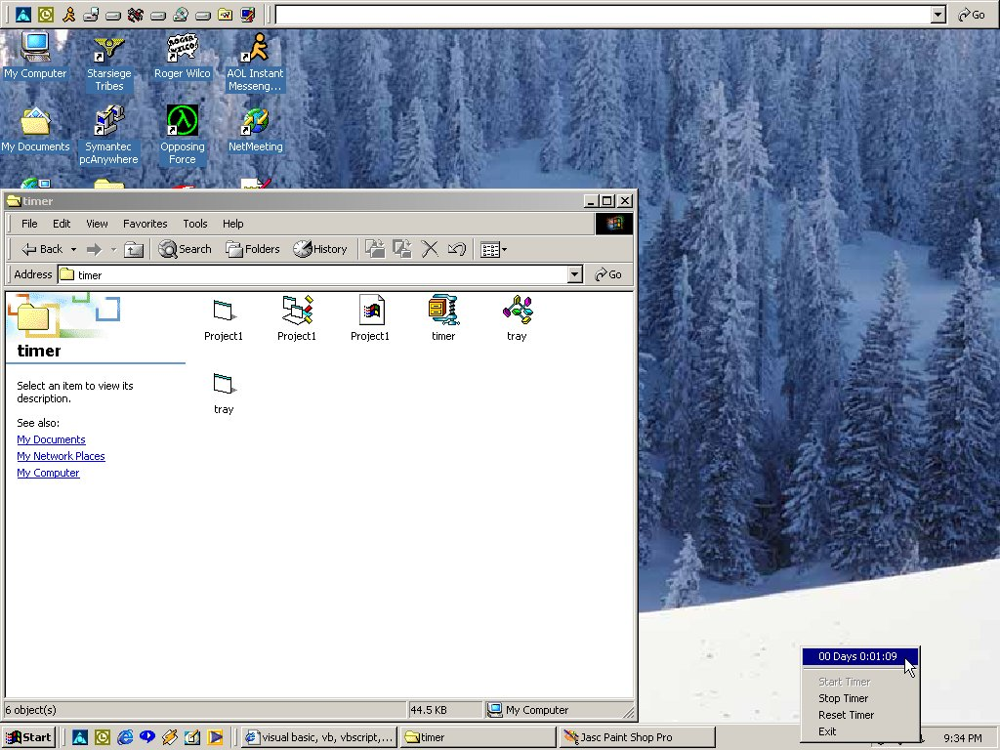



## Advanced Task Bar Timer

### Description

A timer that shows dayys, hour, minute, and seconds. Accurate to .9999 seconds + or - from your windows clock. Works in 95, 98, and yes Windows 2000!
 
### More Info
 

             |
---                |---
**Submitted On**   |2000-05-16 21:31:00
**By**             |[Sum1Else](https://github.com/Planet-Source-Code/PSCIndex/blob/master/ByAuthor/sum1else.md)
**Level**          |Advanced
**User Rating**    |4.8 (29 globes from 6 users)
**Compatibility**  |VB 5\.0, VB 6\.0
**Category**       |[Math/ Dates](https://github.com/Planet-Source-Code/PSCIndex/blob/master/ByCategory/math-dates__1-37.md)
**World**          |[Visual Basic](https://github.com/Planet-Source-Code/PSCIndex/blob/master/ByWorld/visual-basic.md)
**Archive File**   |[CODE\_UPLOAD58555162000\.zip](https://github.com/Planet-Source-Code/sum1else-advanced-task-bar-timer__1-8148/archive/master.zip)

### API Declarations

Please comment if you have find any bugs or anything, i haven't really run it over an hour to test it out

